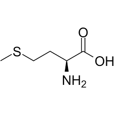

In reality, we would use a long amino acid sequence but for explanation purposes, let's assume we are trying to find the 3D structure of sequence 'ADMGY.' After finding the protein that has the most similar sequence to our input, we do sequence alignment. Imagine this is the result:

    Input   : -ADM-G
    Template: KAD-WG

Now, based on the scoring function, we could have gotten this (and our code looks for these type of patterns).

    Input   : -ADMG
    Template: KADWG

Now, we would get template's PDB file from RCSB database. It will look exactly like the following, except the coordinates, I am making them up for this demo. Also, there should be more space between the last two columns, I have reduced the space to avoid scrolling left-right to see the full content.

    ATOM      1  N   LYS A   1     -38.359 -49.550  -3.194  1.00 15.40    N  
    ATOM      2  CA  LYS A   1     -37.345 -50.032  -2.271  1.00 16.66    C  
    ATOM      3  C   LYS A   1     -36.138 -49.125  -2.476  1.00 15.50    C  
    ATOM      4  O   LYS A   1     -36.060 -48.410  -3.474  1.00 15.58    O  
    ATOM      5  CB  LYS A   1     -36.967 -51.482  -2.592  1.00 18.64    C  
    ATOM      6  CG  LYS A   1     -38.072 -52.499  -2.331  1.00 22.00    C  
    ATOM      7  CD  LYS A   1     -38.463 -52.530  -0.855  1.00 24.41    C  
    ATOM      8  CE  LYS A   1     -39.517 -53.600  -0.566  1.00 26.44    C  
    ATOM      9  NZ  LYS A   1     -40.793 -53.350  -1.295  1.00 28.24    N
    ATOM     10  N   ALA A   2     -37.860 -34.963  27.208  1.00 10.42    N  
    ATOM     11  CA  ALA A   2     -37.897 -33.650  27.843  1.00 11.27    C  
    ATOM     12  C   ALA A   2     -39.324 -33.238  28.180  1.00 11.22    C  
    ATOM     13  O   ALA A   2     -39.596 -32.731  29.270  1.00 13.05    O  
    ATOM     14  CB  ALA A   2     -37.256 -32.611  26.935  1.00 11.43    C
    ATOM     15  N   ASP A   3     -20.152 -28.710   8.146  1.00 16.15    N  
    ATOM     16  CA  ASP A   3     -19.245 -28.438   9.257  1.00 16.22    C  
    ATOM     17  C   ASP A   3     -19.239 -26.945   9.561  1.00 16.30    C  
    ATOM     18  O   ASP A   3     -18.536 -26.172   8.912  1.00 17.25    O  
    ATOM     19  CB  ASP A   3     -17.826 -28.899   8.914  1.00 15.60    C  
    ATOM     20  CG  ASP A   3     -16.884 -28.819  10.100  1.00 15.80    C  
    ATOM     21  OD1 ASP A   3     -17.273 -28.252  11.148  1.00 16.47    O  
    ATOM     22  OD2 ASP A   3     -15.749 -29.324   9.982  1.00 16.45    O 
    ATOM     23  N   TRP A   4     -12.781 -16.422  27.477  1.00 12.60    N  
    ATOM     24  CA  TRP A   4     -11.797 -16.766  28.496  1.00 12.13    C  
    ATOM     25  C   TRP A   4     -12.220 -18.006  29.269  1.00 11.63    C  
    ATOM     26  O   TRP A   4     -13.401 -18.357  29.290  1.00 11.47    O  
    ATOM     27  CB  TRP A   4     -11.608 -15.577  29.433  1.00 12.57    C  
    ATOM     28  CG  TRP A   4     -11.366 -14.314  28.664  1.00 14.86    C  
    ATOM     29  CD1 TRP A   4     -12.298 -13.387  28.295  1.00 13.88    C  
    ATOM     30  CD2 TRP A   4     -10.131 -13.906  28.061  1.00 15.29    C  
    ATOM     31  NE1 TRP A   4     -11.721 -12.430  27.492  1.00 15.21    N  
    ATOM     32  CE2 TRP A   4     -10.393 -12.724  27.333  1.00 15.49    C  
    ATOM     33  CE3 TRP A   4      -8.829 -14.428  28.061  1.00 14.42    C  
    ATOM     34  CZ2 TRP A   4      -9.397 -12.050  26.607  1.00 16.83    C  
    ATOM     35  CZ3 TRP A   4      -7.836 -13.758  27.339  1.00 16.76    C  
    ATOM     36  CH2 TRP A   4      -8.130 -12.581  26.622  1.00 16.16    C
    ATOM     37  N   GLY A  19     -14.572 -30.109   2.015  1.00 13.58    N  
    ATOM     38  CA  GLY A  19     -13.866 -29.554   3.155  1.00 13.52    C  
    ATOM     39  C   GLY A  19     -13.098 -30.613   3.924  1.00 13.22    C  
    ATOM     40  O   GLY A  19     -12.926 -31.741   3.450  1.00 12.36    O 
    TER      41      GLY A  19
    END

Now, atom number 1 - 9 corresponds to Lysine (K in template sequence), 10 - 14 is Alanine (A), 15 -22 is Aspartic Acid (D), 23 - 36 is Tryptophan (W), and finally 37 - 40 is Glycine (G).

Now, looking at the sequence alignment, first index is gap for input and the match between two sequences start at Alanine. So, we copy line 10 -14 and line 15-22 of template's PDB file and that's the beginning of creating input's PDB file . 

    ATOM     10  N   ALA A   2     -37.860 -34.963  27.208  1.00 10.42    N  
    ATOM     11  CA  ALA A   2     -37.897 -33.650  27.843  1.00 11.27    C  
    ATOM     12  C   ALA A   2     -39.324 -33.238  28.180  1.00 11.22    C  
    ATOM     13  O   ALA A   2     -39.596 -32.731  29.270  1.00 13.05    O  
    ATOM     14  CB  ALA A   2     -37.256 -32.611  26.935  1.00 11.43    C
    ATOM     15  N   ASP A   3     -20.152 -28.710   8.146  1.00 16.15    N  
    ATOM     16  CA  ASP A   3     -19.245 -28.438   9.257  1.00 16.22    C  
    ATOM     17  C   ASP A   3     -19.239 -26.945   9.561  1.00 16.30    C  
    ATOM     18  O   ASP A   3     -18.536 -26.172   8.912  1.00 17.25    O  
    ATOM     19  CB  ASP A   3     -17.826 -28.899   8.914  1.00 15.60    C  
    ATOM     20  CG  ASP A   3     -16.884 -28.819  10.100  1.00 15.80    C  
    ATOM     21  OD1 ASP A   3     -17.273 -28.252  11.148  1.00 16.47    O  
    ATOM     22  OD2 ASP A   3     -15.749 -29.324   9.982  1.00 16.45    O 

Now, we have a mismatch. Input has M (Methionine) while template has W(Tryptophan). By Grantham's distance, we know thye are quite similar, so we can use Tryptophan's coordinates for Methionine. However, Methionine needs 8 lines while Tryptophan has 14 lines. Let's see a sample Methionine and Tryptophan entry side by side.

    ATOM     23  N   TRP A   4     -12.781 -16.422  27.477  1.00 12.60    N  
    ATOM     24  CA  TRP A   4     -11.797 -16.766  28.496  1.00 12.13    C  
    ATOM     25  C   TRP A   4     -12.220 -18.006  29.269  1.00 11.63    C  
    ATOM     26  O   TRP A   4     -13.401 -18.357  29.290  1.00 11.47    O  
    ATOM     27  CB  TRP A   4     -11.608 -15.577  29.433  1.00 12.57    C  
    ATOM     28  CG  TRP A   4     -11.366 -14.314  28.664  1.00 14.86    C  
    ATOM     29  CD1 TRP A   4     -12.298 -13.387  28.295  1.00 13.88    C  
    ATOM     30  CD2 TRP A   4     -10.131 -13.906  28.061  1.00 15.29    C  
    ATOM     31  NE1 TRP A   4     -11.721 -12.430  27.492  1.00 15.21    N  
    ATOM     32  CE2 TRP A   4     -10.393 -12.724  27.333  1.00 15.49    C  
    ATOM     33  CE3 TRP A   4      -8.829 -14.428  28.061  1.00 14.42    C  
    ATOM     34  CZ2 TRP A   4      -9.397 -12.050  26.607  1.00 16.83    C  
    ATOM     35  CZ3 TRP A   4      -7.836 -13.758  27.339  1.00 16.76    C  
    ATOM     36  CH2 TRP A   4      -8.130 -12.581  26.622  1.00 16.16    C
    =========================================================================
    ATOM      1  N   MET A   1     -61.935 -49.543   1.151  1.00 24.59    N  
    ATOM      2  CA  MET A   1     -60.777 -48.606   1.232  1.00 24.23    C  
    ATOM      3  C   MET A   1     -59.868 -48.698   0.013  1.00 23.49    C  
    ATOM      4  O   MET A   1     -59.647 -49.781  -0.534  1.00 21.67    O  
    ATOM      5  CB  MET A   1     -59.950 -48.899   2.480  1.00 27.68    C  
    ATOM      6  CG  MET A   1     -60.653 -48.575   3.782  1.00 29.68    C  
    ATOM      7  SD  MET A   1     -59.663 -49.172   5.140  1.00 37.79    S  
    ATOM      8  CE  MET A   1     -58.247 -48.120   4.983  1.00 34.83    C 

Now, using site like [Hack-a-Mol](https://chemapps.stolaf.edu/jmol/jsmol/hackamol.htm) we can map out which line corresponds to which atom position. For Tryptophan, it looks like the following. 

Now, looking at TRP and MET side by side, we can see the structure is identical for the first 6 lines of the PDB. Then,sulfur (SD) will be in CD2's position and CE in MET will be in CE3's position for TRP. So, we have:

    ATOM     23  N   TRP A   4     -12.781 -16.422  27.477  1.00 12.60    N  
    ATOM     24  CA  TRP A   4     -11.797 -16.766  28.496  1.00 12.13    C  
    ATOM     25  C   TRP A   4     -12.220 -18.006  29.269  1.00 11.63    C  
    ATOM     26  O   TRP A   4     -13.401 -18.357  29.290  1.00 11.47    O  
    ATOM     27  CB  TRP A   4     -11.608 -15.577  29.433  1.00 12.57    C  
    ATOM     28  CG  TRP A   4     -11.366 -14.314  28.664  1.00 14.86    C   
    ATOM     30  CD2 TRP A   4     -10.131 -13.906  28.061  1.00 15.29    C  
    ATOM     33  CE3 TRP A   4      -8.829 -14.428  28.061  1.00 14.42    C  

However, even though this a MET entry, we will keep it TRP for now, and fix it in the end. FInally, there is a match with Glycine, so we just again copy the lines from template PDB file. Also, to signify, end of chain and end of file marker, we copy the termination (TER) and END line. So, in the end, our input PDB looks like this:

    ATOM     10  N   ALA A   2     -37.860 -34.963  27.208  1.00 10.42    N  
    ATOM     11  CA  ALA A   2     -37.897 -33.650  27.843  1.00 11.27    C  
    ATOM     12  C   ALA A   2     -39.324 -33.238  28.180  1.00 11.22    C  
    ATOM     13  O   ALA A   2     -39.596 -32.731  29.270  1.00 13.05    O  
    ATOM     14  CB  ALA A   2     -37.256 -32.611  26.935  1.00 11.43    C
    ATOM     15  N   ASP A   3     -20.152 -28.710   8.146  1.00 16.15    N  
    ATOM     16  CA  ASP A   3     -19.245 -28.438   9.257  1.00 16.22    C  
    ATOM     17  C   ASP A   3     -19.239 -26.945   9.561  1.00 16.30    C  
    ATOM     18  O   ASP A   3     -18.536 -26.172   8.912  1.00 17.25    O  
    ATOM     19  CB  ASP A   3     -17.826 -28.899   8.914  1.00 15.60    C  
    ATOM     20  CG  ASP A   3     -16.884 -28.819  10.100  1.00 15.80    C  
    ATOM     21  OD1 ASP A   3     -17.273 -28.252  11.148  1.00 16.47    O  
    ATOM     22  OD2 ASP A   3     -15.749 -29.324   9.982  1.00 16.45    O 
    ATOM     23  N   TRP A   4     -12.781 -16.422  27.477  1.00 12.60    N  
    ATOM     24  CA  TRP A   4     -11.797 -16.766  28.496  1.00 12.13    C  
    ATOM     25  C   TRP A   4     -12.220 -18.006  29.269  1.00 11.63    C  
    ATOM     26  O   TRP A   4     -13.401 -18.357  29.290  1.00 11.47    O  
    ATOM     27  CB  TRP A   4     -11.608 -15.577  29.433  1.00 12.57    C  
    ATOM     28  CG  TRP A   4     -11.366 -14.314  28.664  1.00 14.86    C   
    ATOM     30  CD2 TRP A   4     -10.131 -13.906  28.061  1.00 15.29    C  
    ATOM     33  CE3 TRP A   4      -8.829 -14.428  28.061  1.00 14.42    C
    ATOM     37  N   GLY A  19     -14.572 -30.109   2.015  1.00 13.58    N  
    ATOM     38  CA  GLY A  19     -13.866 -29.554   3.155  1.00 13.52    C  
    ATOM     39  C   GLY A  19     -13.098 -30.613   3.924  1.00 13.22    C  
    ATOM     40  O   GLY A  19     -12.926 -31.741   3.450  1.00 12.36    O 
    TER      41      GLY A  19
    END

Now, we have some postprocessing to do to make this a valid PDB file. First, the atom serial number in column 2 is not correct. It should start from 1 and keep incrementing. Also, the residue number in column 6 is off. It should start from 1 too. So, after fixing these two columns, we have:

    ATOM      1  N   ALA A   1     -37.860 -34.963  27.208  1.00 10.42    N  
    ATOM      2  CA  ALA A   1     -37.897 -33.650  27.843  1.00 11.27    C  
    ATOM      3  C   ALA A   1     -39.324 -33.238  28.180  1.00 11.22    C  
    ATOM      4  O   ALA A   1     -39.596 -32.731  29.270  1.00 13.05    O  
    ATOM      5  CB  ALA A   1     -37.256 -32.611  26.935  1.00 11.43    C
    ATOM      6  N   ASP A   2     -20.152 -28.710   8.146  1.00 16.15    N  
    ATOM      7  CA  ASP A   2     -19.245 -28.438   9.257  1.00 16.22    C  
    ATOM      8  C   ASP A   2     -19.239 -26.945   9.561  1.00 16.30    C  
    ATOM      9  O   ASP A   2     -18.536 -26.172   8.912  1.00 17.25    O  
    ATOM     10  CB  ASP A   2     -17.826 -28.899   8.914  1.00 15.60    C  
    ATOM     11  CG  ASP A   2     -16.884 -28.819  10.100  1.00 15.80    C  
    ATOM     12  OD1 ASP A   2     -17.273 -28.252  11.148  1.00 16.47    O  
    ATOM     13  OD2 ASP A   2     -15.749 -29.324   9.982  1.00 16.45    O 
    ATOM     14  N   TRP A   3     -12.781 -16.422  27.477  1.00 12.60    N  
    ATOM     15  CA  TRP A   3     -11.797 -16.766  28.496  1.00 12.13    C  
    ATOM     16  C   TRP A   3     -12.220 -18.006  29.269  1.00 11.63    C  
    ATOM     17  O   TRP A   3     -13.401 -18.357  29.290  1.00 11.47    O  
    ATOM     18  CB  TRP A   3     -11.608 -15.577  29.433  1.00 12.57    C  
    ATOM     19  CG  TRP A   3     -11.366 -14.314  28.664  1.00 14.86    C   
    ATOM     20  CD2 TRP A   3     -10.131 -13.906  28.061  1.00 15.29    C  
    ATOM     21  CE3 TRP A   3      -8.829 -14.428  28.061  1.00 14.42    C
    ATOM     22  N   GLY A   4     -14.572 -30.109   2.015  1.00 13.58    N  
    ATOM     23  CA  GLY A   4     -13.866 -29.554   3.155  1.00 13.52    C  
    ATOM     24  C   GLY A   4     -13.098 -30.613   3.924  1.00 13.22    C  
    ATOM     25  O   GLY A   4     -12.926 -31.741   3.450  1.00 12.36    O 
    TER      26      GLY A   4
    END

Finally, we keep track of collisions like MET and TRP, so we make necessary updates and the final input PDB will look like this:

    ATOM      1  N   ALA A   1     -37.860 -34.963  27.208  1.00 10.42    N  
    ATOM      2  CA  ALA A   1     -37.897 -33.650  27.843  1.00 11.27    C  
    ATOM      3  C   ALA A   1     -39.324 -33.238  28.180  1.00 11.22    C  
    ATOM      4  O   ALA A   1     -39.596 -32.731  29.270  1.00 13.05    O  
    ATOM      5  CB  ALA A   1     -37.256 -32.611  26.935  1.00 11.43    C
    ATOM      6  N   ASP A   2     -20.152 -28.710   8.146  1.00 16.15    N  
    ATOM      7  CA  ASP A   2     -19.245 -28.438   9.257  1.00 16.22    C  
    ATOM      8  C   ASP A   2     -19.239 -26.945   9.561  1.00 16.30    C  
    ATOM      9  O   ASP A   2     -18.536 -26.172   8.912  1.00 17.25    O  
    ATOM     10  CB  ASP A   2     -17.826 -28.899   8.914  1.00 15.60    C  
    ATOM     11  CG  ASP A   2     -16.884 -28.819  10.100  1.00 15.80    C  
    ATOM     12  OD1 ASP A   2     -17.273 -28.252  11.148  1.00 16.47    O  
    ATOM     13  OD2 ASP A   2     -15.749 -29.324   9.982  1.00 16.45    O 
    ATOM     14  N   MET A   3     -12.781 -16.422  27.477  1.00 12.60    N  
    ATOM     15  CA  MET A   3     -11.797 -16.766  28.496  1.00 12.13    C  
    ATOM     16  C   MET A   3     -12.220 -18.006  29.269  1.00 11.63    C  
    ATOM     17  O   MET A   3     -13.401 -18.357  29.290  1.00 11.47    O  
    ATOM     18  CB  MET A   3     -11.608 -15.577  29.433  1.00 12.57    C  
    ATOM     19  CG  MET A   3     -11.366 -14.314  28.664  1.00 14.86    C   
    ATOM     20  SD  MET A   3     -10.131 -13.906  28.061  1.00 15.29    C  
    ATOM     21  CE  MET A   3      -8.829 -14.428  28.061  1.00 14.42    C
    ATOM     22  N   GLY A   4     -14.572 -30.109   2.015  1.00 13.58    N  
    ATOM     23  CA  GLY A   4     -13.866 -29.554   3.155  1.00 13.52    C  
    ATOM     24  C   GLY A   4     -13.098 -30.613   3.924  1.00 13.22    C  
    ATOM     25  O   GLY A   4     -12.926 -31.741   3.450  1.00 12.36    O 
    TER      26      GLY A   4
    END

Now, if you just copy the MET part, and see the 3D model, you will see the bond length between sulfur and carbon is smaller than it should be. That's the error in our prediction. To overcome this problem, we are trying to multiple sequence alignment instead of finding one best match protein, so that we can directly extract the coordinates.
