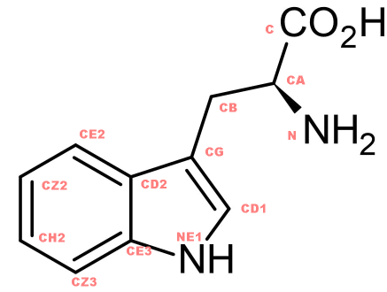
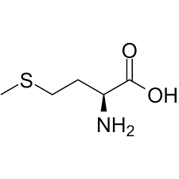
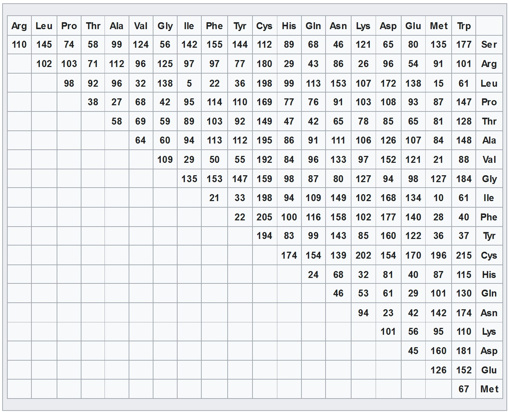

Now, we have a mismatch. Input has M (Methionine) while template has W(Tryptophan). By Grantham's distance, we know they are quite similar, so we can use Tryptophan's coordinates for Methionine. However, Methionine needs 8 lines while Tryptophan has 14 lines. Let's see a sample Methionine and Tryptophan entry side by side.

    ATOM     23  N   TRP A   4     -12.781 -16.422  27.477  1.00 12.60    N  
    ATOM     24  CA  TRP A   4     -11.797 -16.766  28.496  1.00 12.13    C  
    ATOM     25  C   TRP A   4     -12.220 -18.006  29.269  1.00 11.63    C  
    ATOM     26  O   TRP A   4     -13.401 -18.357  29.290  1.00 11.47    O  
    ATOM     27  CB  TRP A   4     -11.608 -15.577  29.433  1.00 12.57    C  
    ATOM     28  CG  TRP A   4     -11.366 -14.314  28.664  1.00 14.86    C  
    ATOM     29  CD1 TRP A   4     -12.298 -13.387  28.295  1.00 13.88    C  
    ATOM     30  CD2 TRP A   4     -10.131 -13.906  28.061  1.00 15.29    C  
    ATOM     31  NE1 TRP A   4     -11.721 -12.430  27.492  1.00 15.21    N  
    ATOM     32  CE2 TRP A   4     -10.393 -12.724  27.333  1.00 15.49    C  
    ATOM     33  CE3 TRP A   4      -8.829 -14.428  28.061  1.00 14.42    C  
    ATOM     34  CZ2 TRP A   4      -9.397 -12.050  26.607  1.00 16.83    C  
    ATOM     35  CZ3 TRP A   4      -7.836 -13.758  27.339  1.00 16.76    C  
    ATOM     36  CH2 TRP A   4      -8.130 -12.581  26.622  1.00 16.16    C
    =========================================================================
    ATOM      1  N   MET A   1     -61.935 -49.543   1.151  1.00 24.59    N  
    ATOM      2  CA  MET A   1     -60.777 -48.606   1.232  1.00 24.23    C  
    ATOM      3  C   MET A   1     -59.868 -48.698   0.013  1.00 23.49    C  
    ATOM      4  O   MET A   1     -59.647 -49.781  -0.534  1.00 21.67    O  
    ATOM      5  CB  MET A   1     -59.950 -48.899   2.480  1.00 27.68    C  
    ATOM      6  CG  MET A   1     -60.653 -48.575   3.782  1.00 29.68    C  
    ATOM      7  SD  MET A   1     -59.663 -49.172   5.140  1.00 37.79    S  
    ATOM      8  CE  MET A   1     -58.247 -48.120   4.983  1.00 34.83    C 

Now, using site like [Hack-a-Mol](https://chemapps.stolaf.edu/jmol/jsmol/hackamol.htm) we can map out which line corresponds to which atom position. For Tryptophan, it looks like the following. 

Now, looking at TRP and MET side by side, we can see the structure is identical for the first 6 lines of the PDB. Then,sulfur (SD) will be in CD2's position and CE in MET will be in CE3's position for TRP. So, we have:

    ATOM     23  N   TRP A   4     -12.781 -16.422  27.477  1.00 12.60    N  
    ATOM     24  CA  TRP A   4     -11.797 -16.766  28.496  1.00 12.13    C  
    ATOM     25  C   TRP A   4     -12.220 -18.006  29.269  1.00 11.63    C  
    ATOM     26  O   TRP A   4     -13.401 -18.357  29.290  1.00 11.47    O  
    ATOM     27  CB  TRP A   4     -11.608 -15.577  29.433  1.00 12.57    C  
    ATOM     28  CG  TRP A   4     -11.366 -14.314  28.664  1.00 14.86    C   
    ATOM     30  CD2 TRP A   4     -10.131 -13.906  28.061  1.00 15.29    C  
    ATOM     33  CE3 TRP A   4      -8.829 -14.428  28.061  1.00 14.42    C  

However, even though this a MET entry, we will keep it TRP for now, and fix it in the end. 

Grantham Distance Table:

If Grantham distance between two protein is below 70, then they are close enough. The folder this markdown file is in has svg files of each amino acid that shows what line of PDB entry corresponds to which bond. For example, If you open the GLY.svg and the aa_format_pdb.txt side by side, you will see what bonds N,CA,C,O corresponds to. Now, following the process above, you can get coordinates of similar amino acids.

 Also, if you can find what how to handle cases where two proteins are very different (high Grantham distance) that would be great.
